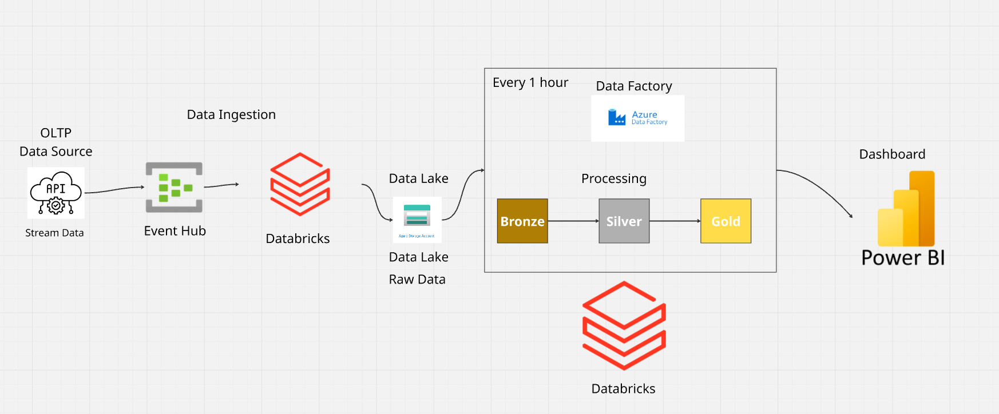
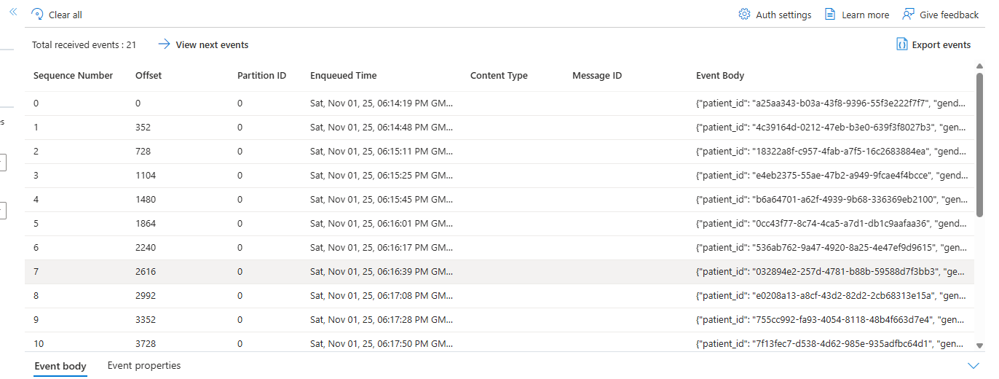
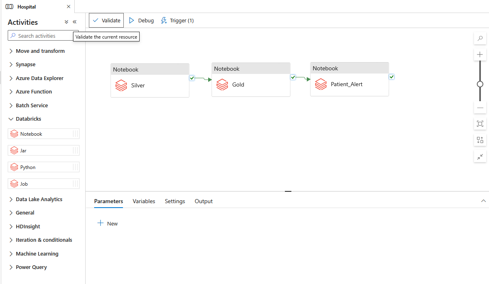
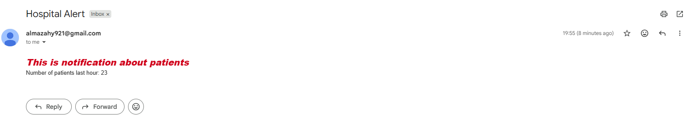
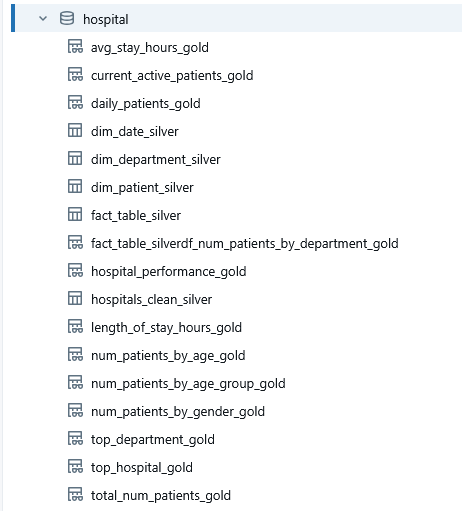

# 🏥 Real-time Hospital Operations & Alerting System (Azure Data Lakehouse)

A comprehensive **Data Engineering and Analytics** project aimed at building a modern **Data Lakehouse** platform on **Microsoft Azure**. The project ingests high-velocity patient data as a **Stream**, processes it through a robust **Medallion Architecture**, and provides a single, critical **Live Operations Dashboard** with an automated alert system in Power BI.

---

## 🛠️ Tools & Technologies

| Category | Tool | Primary Use |
| :--- | :--- | :--- |
| **Data Ingestion** | Fake Data Generator | Simulating high-velocity patient admission/discharge events (Stream Data). |
| **Messaging & Ingestion** | **Azure Event Hub** | Central ingress point for collecting high-throughput stream data. |
| **Storage** | **Azure Data Lake Storage (Gen2)** | Centralized, cost-effective storage for all data layers (Bronze, Silver, Gold). |
| **Processing Engine** | **Azure Databricks (PySpark/SQL)** | Executing ETL/ELT logic, data cleaning, and complex transformations. |
| **Orchestration** | **Azure Data Factory (ADF)** | Scheduling and running the Databricks processing notebooks on an **hourly basis**. |
| **Alerting Workflow** | **Azure Logic App** | Automated workflow to trigger and send an email notification when the critical patient threshold is exceeded. |
| **Visualization** | **Microsoft Power BI** | Professional, real-time dashboarding for operational monitoring. |

---
## 💻 Data Generation Output & Raw Data Structure

This section demonstrates the successful execution of the data simulation code and the format of the raw data as it enters the pipeline.

### 1. Source Data Simulation (Code Results)

A screenshot of the Python/PySpark notebook output demonstrating the continuous generation of fake patient data records.

****

### 2. Event Hub Raw Data Format

The structure of the raw event messages ingested into Azure Event Hub. This shows the immediate schema of the streaming data.

---
## 🏗️ Technical Architecture & Data Pipeline

The pipeline follows the **Medallion Architecture** (Bronze-Silver-Gold) implemented on the Azure Lakehouse, ensuring data reliability and efficiency from ingestion to consumption.

****

### 1. Data Ingestion (Source → Bronze Layer)

****

* **Source to Event Hub:** New patient admission/discharge data is generated and streamed into **Azure Event Hub**.
* **Bronze Layer:** A Databricks job consumes the events and writes the data **raw and untouched** to the Data Lake Storage.
  
### 2. Bronze Layer Storage Format

The raw data is stored in the Data Lake in its original format (e.g., JSON or CSV format, typically partitioned).

****

### 3. Orchestration Pipeline (Azure Data Factory)

The entire process is automated via Azure Data Factory pipelines, ensuring the Silver and Gold layers are updated hourly.

****

### 4. Data Processing (Silver → Gold Layers)

* **Silver Layer:** Cleansed, validated, and normalized data is created to serve as the unified, single source of truth.
* **Gold Layer:** **12 highly optimized views** (Data Marts) are pre-calculated to serve the Power BI report directly, ensuring high performance.

### 5. Alerting & Automation

* **Critical Metric:** The system continuously monitors the `current_active_patients_gold` metric.
* **Action:** If the count of active patients **exceeds 200**, the **Azure Logic App** is instantly triggered to send a critical alert notification.

****

---

## 🗄️ Gold Layer Insights (Data Marts)

The Gold layer contains 12 highly optimized SQL Views used to power the single Live Operations Dashboard and the alerting system.

| SQL View | Description | Analytical Goal |
| :--- | :--- | :--- |
| `current_active_patients_gold` | **Critical KPI: Count of patients currently admitted.** | The core metric for the **Alerting System** and the Live Dashboard. |
| `avg_stay_hours_gold` | Overall average length of patient stay (in hours). | Primary efficiency metric to measure system throughput. |
| `top_department_gold` | The single department that has received the most patients. | Quick operational KPI to identify the current high-demand area. |
| `df_Num_patients_by_department_gold` | Patient count broken down by every department. | Detailed workload distribution analysis for the Treemap visual. |
| `Num_patients_by_age_group_gold` | Patient count categorized into defined age groups. | Understanding demographic distribution for the Age Group Bar Chart. |
| `daily_patients_gold` | Total patient admissions aggregated by day. | Used for the Admissions Trend Area Chart. |
| `Num_patients_by_gender_gold` | Patient count broken down by gender. | Used for the Gender Donut Chart. |
| `total_num_patients_gold` | Total unique patients historically admitted. | High-level KPI for tracking overall system scale. |
| `top_hospital_gold` | The hospital with the highest total patient count. | Operational KPI for identifying the leading hospital unit. |
| `length_of_stay_hours_gold` | Average length of stay hours per department. | Detailed efficiency metric for departmental analysis. |
| `hospital_performance_gold` | Comparative table showing admissions and average stay across all hospitals. | Used for comparative review (if a drill-through page is later implemented). |
| `Num_patients_by_age_gold` | Patient count broken down by individual age. | Granular demographic analysis. |

****
---

## 📈 Power BI Report Overview (Live Operations Dashboard)

The final report consists of a **single, unified Live Operations Dashboard**. It is designed with a **Light Mode Theme** to ensure maximum visibility for the critical alert status.

* **Title:** **Live Operations** (The Real-time Control Center).
* **KPI Cards:** Displays aggregated figures such as **Sum of avg_los_hours (75)**, **Sum of num_admissions (384)**, and the **Busiest Department (Emergency)**.
* **Alert Indicator:** A Gauge visual (not shown in the snapshot but essential for the project) is used to monitor the `Current Active Patients` KPI and turn red above the critical threshold.
* **Key Visuals:**
    1.  **Admissions Trend:** An Area Chart tracking daily patient admissions.
    2.  **Patients by Age Group:** A Horizontal Bar Chart showing the distribution of patients across categories (Seniors, Adults, Youth, Children).
    3.  **Patients by Departments:** A **Treemap** visualizing workload distribution across key hospital departments (e.g., Oncology, Surgery, ICU).
    4.  **Patients by Gender:** A Donut Chart showing the male/female distribution (57.41% Female, 42.59% Male in the example).

---
👤 **Mazen Sehsah**
